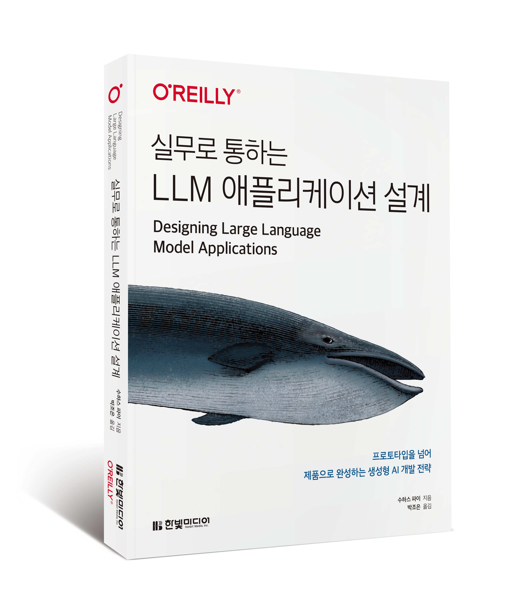

## 실무로 통하는 LLM 어플리케이션 설계

* 예스24: https://www.yes24.com/product/goods/158678739
* 알라딘: https://www.aladin.co.kr/shop/wproduct.aspx?ItemId=374262612
* 교보: https://product.kyobobook.co.kr/detail/S000218171872

### 원서 정보
* 원서 : Designing Large Language Model Applications: A Holistic Approach to LLMs
* 원서 github : https://github.com/piesauce/llm-playbooks
* amazon : https://www.amazon.com/Designing-Large-Language-Model-Applications/dp/1098150503

### 실습 데이터셋
| 데이터셋 | 링크 | 설명 |
|---------|------|------|
| 캐나다 의회 데이터셋 | https://huggingface.co/datasets/hudson-labs/canada-training/tree/main | openparliament.ca에서 수집한 캐나다 의회 회의록 • bills_json: 캐나다 의회에 제출된 각 법안의 전체 본문 • political_speeches.json: 의회 진행 중 국회의원(MP)들의 발언 회의록 |
| S&P 500 기업들의 연차 보고서(10-K) | https://huggingface.co/datasets/jlohding/sp500-edgar-10k | S&P 500 기업들의 연차 보고서 데이터 • 각 섹션 설명: https://en.wikipedia.org/wiki/Form_10-K |